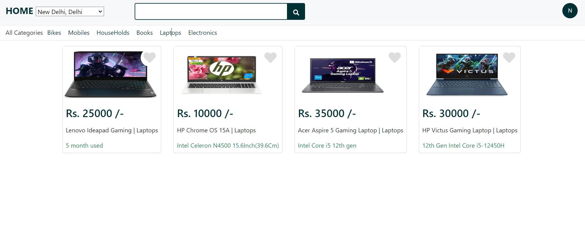
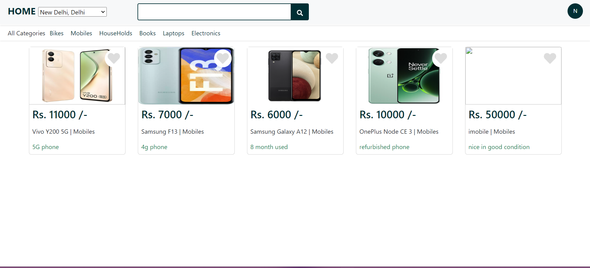
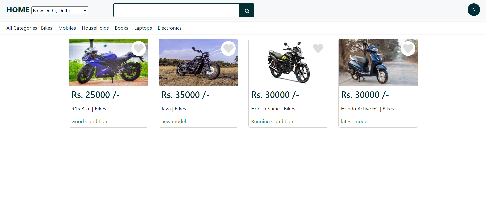

OLX Clone - MEAN Stack
This project is a clone of the OLX classified ads website, built using the MEAN stack (MongoDB, Express.js, Angular, Node.js). It provides a platform for users to post, browse, and manage classified ads seamlessly.

Features
User Authentication: Secure login and registration system to protect user accounts.

Ad Posting and Management: Users can create, edit, and delete their ads with ease.

Image Uploads: Integrated image upload functionality to enhance ad visibility.

Real-Time Notifications: Real-time updates and notifications using Socket.io for enhanced user engagement.

Search and Filter: Robust search and filter options to quickly find relevant ads.

Responsive Design: Fully responsive design for optimal viewing on any device.

Performance Optimization: Efficient database queries and caching mechanisms to ensure fast load times and high scalability.
 
 Home page 
 
 Electronices Menu
 
 Laptops menu
  
 Books Menu
 
 Phones Menu
  
 HouseHolds Menu
  
 Bike Menu
  
 Add Product Page
 
